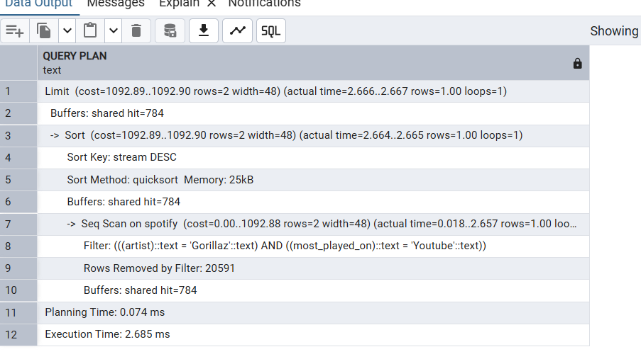
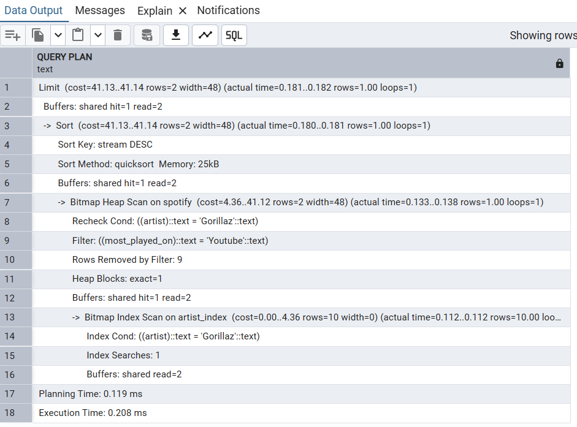
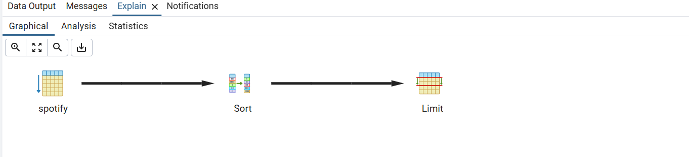
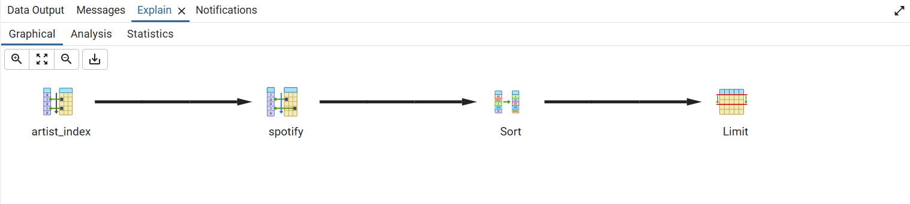

# Spotify Advanced SQL Project and Query Optimization P-5

[Click Here to get Dataset](https://www.kaggle.com/datasets/sanjanchaudhari/spotify-dataset)

**Project Title**: Spotify Advanced SQL Project and Query Optimization P-5
**Level**: Intermediate
**Database**: `spotify_db_p5`

## Overview
This project involves analyzing a Spotify dataset with various attributes about tracks, albums, and artists using **SQL**. It covers an end-to-end SQL analysis process, including data exploration, SQL queries of varying complexity (easy, medium, and advanced), and query performance optimization. The primary goals of the project are to practice advanced SQL skills and generate valuable insights from the dataset.

```sql
-- create table
DROP TABLE IF EXISTS spotify;
CREATE TABLE spotify (
    artist VARCHAR(255),
    track VARCHAR(255),
    album VARCHAR(255),
    album_type VARCHAR(50),
    danceability FLOAT,
    energy FLOAT,
    loudness FLOAT,
    speechiness FLOAT,
    acousticness FLOAT,
    instrumentalness FLOAT,
    liveness FLOAT,
    valence FLOAT,
    tempo FLOAT,
    duration_min FLOAT,
    title VARCHAR(255),
    channel VARCHAR(255),
    views FLOAT,
    likes BIGINT,
    comments BIGINT,
    licensed BOOLEAN,
    official_video BOOLEAN,
    stream BIGINT,
    energy_liveness FLOAT,
    most_played_on VARCHAR(50)
);
```
## Project Steps

### Data Exploration
Before diving into SQL, it’s important to understand the dataset thoroughly. The dataset contains attributes such as:
- `Artist`: The performer of the track.
- `Track`: The name of the song.
- `Album`: The album to which the track belongs.
- `Album_type`: The type of album (e.g., single or album).
- Various metrics such as `danceability`, `energy`, `loudness`, `tempo`, and more.

### Querying the Data
After the data is inserted, various SQL queries can be written to explore and analyze the data. Queries are categorized into **easy**, **medium**, and **advanced** levels to help progressively develop SQL proficiency.

#### Easy Queries
- Simple data retrieval, filtering, and basic aggregations.
  
#### Medium Queries
- More complex queries involving grouping, aggregation functions, and joins.
  
#### Advanced Queries
- Nested subqueries, window functions, CTEs, and performance optimization.

### Query Optimization
In advanced stages, the focus shifts to improving query performance. Some optimization strategies include:
- **Indexing**: Adding indexes on frequently queried columns.
- **Query Execution Plan**: Using `EXPLAIN ANALYZE` to review and refine query performance.
  
---

## 14 Practice Questions

### Easy Level
1. Retrieve the names of all tracks that have more than 1 billion streams.
```sql

SELECT *
FROM spotify
WHERE stream > 1000000000;
```
2. List all albums along with their respective artists.
```sql

SELECT 
	DISTINCT album, artist
FROM spotify
ORDER BY album;

```
3. Get the total number of comments for tracks where `licensed = TRUE`.
```sql

SELECT 
	SUM(comments) as total_comments
FROM spotify
WHERE licensed = TRUE;

```
4. Find all tracks that belong to the album type `single`.
```sql

SELECT *
FROM spotify
WHERE album_type = 'single';
```
5. Count the total number of tracks by each artist.
```sql

SELECT 
	artist,
	COUNT(*) as total_songs
FROM spotify
GROUP BY artist
ORDER BY total_songs;
```

### Medium Level
1. Calculate the average danceability of tracks in each album.
```sql

SELECT 
	album,
	AVG(danceability) as avg_danceability
FROM spotify
GROUP BY album
ORDER BY avg_danceability DESC;
```
2. Find the top 5 tracks with the highest energy values.
```sql

SELECT 
	track,
	AVG(energy) as avg_energy
FROM spotify
GROUP BY track
ORDER BY avg_energy DESC
LIMIT 5;

```
3. List all tracks along with their views and likes where `official_video = TRUE`.
```sql
SELECT 
	track,
	SUM(views) as total_views,
	SUM(likes) as total_likes
FROM spotify
WHERE official_video = TRUE
GROUP BY track;
```
4. For each album, calculate the total views of all associated tracks.
```sql

SELECT 
	album,
	SUM(views) as total_views
FROM spotify
GROUP BY album
ORDER BY total_views DESC;
```
5. Retrieve the track names that have been streamed on Spotify more than YouTube.
```sql

SELECT * FROM
(SELECT 
	track,
	COALESCE (SUM(CASE WHEN most_played_on = 'Youtube' THEN stream END),0)as streamed_on_youtube,
	COALESCE (SUM(CASE WHEN most_played_on = 'Spotify' THEN stream END),0)as streamed_on_spotify
FROM spotify
GROUP BY track
)AS t1
WHERE
	streamed_on_spotify > streamed_on_youtube
	AND 
	streamed_on_youtube <>0;

```

### Advanced Level
1. Find the top 3 most-viewed tracks for each artist using window functions.
```sql

WITH ranking_artist AS (
    SELECT 
        artist,
        track,
        SUM(views) AS total_view,
        DENSE_RANK() OVER (
            PARTITION BY artist 
            ORDER BY SUM(views) DESC
        ) AS ranking
    FROM spotify
    GROUP BY artist, track
)
SELECT *
FROM ranking_artist
WHERE ranking <= 3;

```
2. Write a query to find tracks where the liveness score is above the average.
```sql
SELECT 
	track,
	artist,
	liveness
FROM spotify
WHERE liveness > (SELECT AVG(liveness) FROM spotify);
```
3. **Use a `WITH` clause to calculate the difference between the highest and lowest energy values for tracks in each album.**
```sql
WITH cte
AS
(SELECT 
	album,
	MAX(energy) as highest_energy,
	MIN(energy) as lowest_energy
FROM spotify
GROUP BY album
)
SELECT 
	album,
	highest_energy - lowest_energy as energy_diff
FROM cte
ORDER BY energy_diff DESC
```
   

4. Calculate the cumulative sum of likes for tracks ordered by the number of views, using window functions.
```sql
SELECT 
    track,
    views,
    likes,
    SUM(likes) OVER (
        ORDER BY views DESC, track
    ) AS cumulative_likes
FROM spotify;
```

Here’s an updated section for your **Spotify Advanced SQL Project and Query Optimization** README, focusing on the query optimization task you performed. You can include the specific screenshots and graphs as described.

---

## Query Optimization Technique 

To improve query performance, we carried out the following optimization process:

- **Initial Query Performance Analysis Using `EXPLAIN`**
    - We began by analyzing the performance of a query using the `EXPLAIN` function.
    - The query retrieved tracks based on the `artist` column, and the performance metrics were as follows:
        - Execution time (E.T.): **2.685 ms**
        - Planning time (P.T.): **0.074 ms**
    - Below is the **screenshot** of the `EXPLAIN` result before optimization:
    

- **Index Creation on the `artist` Column**
    - To optimize the query performance, we created an index on the `artist` column. This ensures faster retrieval of rows where the artist is queried.
    - **SQL command** for creating the index:
      ```sql
      CREATE INDEX idx_artist ON spotify(artist);
      ```

- **Performance Analysis After Index Creation**
    - After creating the index, the query execution time decreased in this test environment.
        - Execution time (E.T.): **0.208 ms**
        - Planning time (P.T.): **0.119 ms**
  Below is the **screenshot** of the `EXPLAIN` result after optimization:



- **Graphical Performance Comparison**
    - A graph illustrating the comparison between the initial query execution time and the optimized query execution time after index creation.
    The index significantly reduced the query execution time in this test environment, while planning time showed a small variation.
    
      
   
This experiment demonstrates how indexing can improve query performance for queries that filter data using frequently searched columns.

---

## License
This project is licensed under the MIT License.
